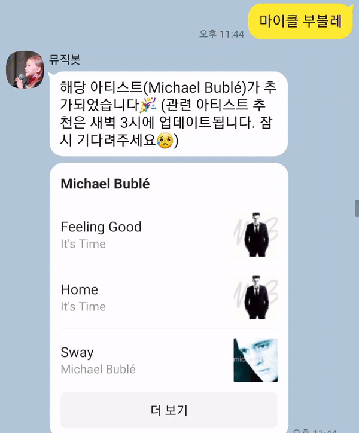
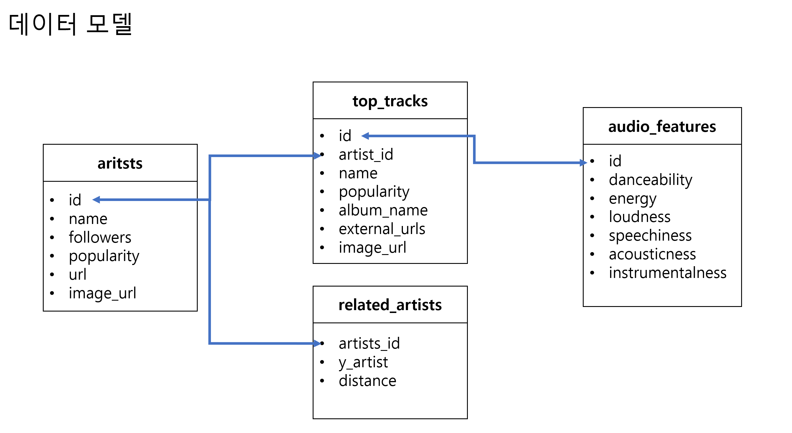
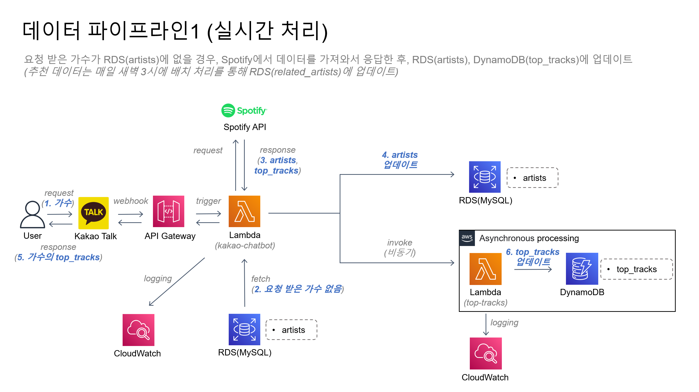
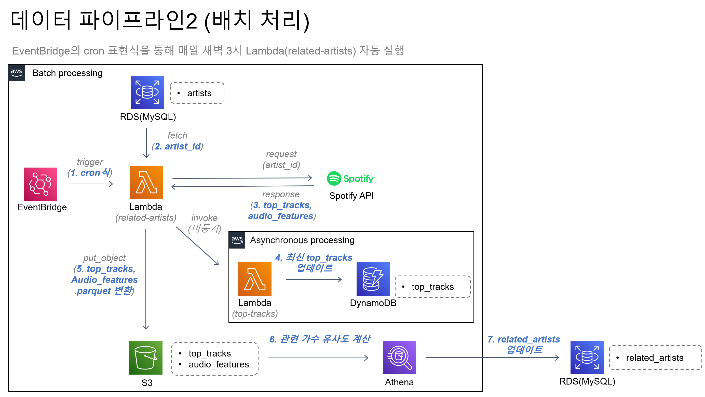
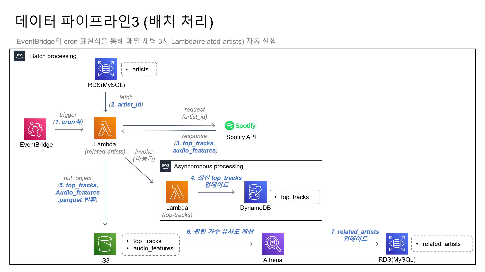

# 카카오 추천 챗봇 (using Spotify data)

- 해당 챗봇🤖은 카카오톡에서 `뮤직봇` 채널을 검색하시면, 이용할 수 있습니다. (<a href="https://pf.kakao.com/_acwkxj">https://pf.kakao.com/_acwkxj</a>)
- 코드는 <a href="https://github.com/dksudtjr/kakao-chatbot">https://github.com/dksudtjr/kakao-chatbot</a>에서 확인할 수 있습니다.

  

## 🔍 Preview
 
1. 새로운 가수 요청 시, 실시간 응답 및 DB 업데이트
  

&nbsp;&nbsp;&nbsp;&nbsp; </img>

  
2. 매일 새벽 3시 배치 처리 이후, 관련 가수 추천
  
&nbsp;&nbsp;&nbsp;&nbsp; </img>

  

## 📖 Table of Contents

 

1. [Background](#1-Background) 
    1-1) [AWS Lambda](#1-1-aws-lambda) 
    1-2) [Amazon Athena](#1-2-amazon-athena) 
    1-3) [.parquet](#1-3-parquet) 
2. [개발 환경](#2-개발-환경) 
    2-1) [주요 개발 환경](#2-1-주요-개발-환경) 
    2-2) [개발 환경 선택 이유](#2-2-개발-환경-선택-이유) 
3. [프로젝트 설명](#3-프로젝트-설명) 
    3-1) [프로젝트 소개](#3-1-프로젝트-소개) 
    3-2) [데이터 모델](#3-2-데이터-모델) 
    3-3) [데이터 파이프라인 ⭐](#3-3-데이터-파이프라인-) 
    3-4) [전체 프로세스 요약 ⭐](#3-4-전체-프로세스-요약-) 
    3-5) [주요 고려 사항 ⭐](#3-5-주요-고려-사항-) 
4. [파일 설명](#4-파일-설명)

  

## 1. Background

### 1-1) `AWS Lambda`

- 개념
     `AWS Lambda`는 이벤트에 대한 응답으로 코드를 실행하고 자동으로 컴퓨팅 리소스를 관리하는 서버리스 컴퓨팅 서비스입니다. 하루에 수십 개의 이벤트에서 초당 수십만 개에 이르기까지 어떤 규모에서든 코드 실행 요청에 자동으로 응답합니다. Amazon API Gateway를 통한 HTTP 요청, Amazon Simple Storage Service(Amazon S3) 버킷에 있는 객체에 대한 변경 사항, Amazon DynamoDB의 테이블 업데이트 또는 AWS Step Functions의 상태 전환과 같은 다양한 이벤트에 대한 응답으로 코드를 자동 실행할 수 있습니다. 사용한 컴퓨팅 시간만큼만 비용을 지불하고, 코드가 실행되지 않을 때는 요금이 부과되지 않습니다.

- 장점

    `AWS Lambda`는 대표적으로 다음과 같은 장점을 가지고 있습니다. 특히 요청에 따라 함수 단위로 자동 확장되기 때문에 수많은 요청을 처리하는 데 적합합니다. 

    1. `서버리스 아키텍처`: AWS Lambda는 서버리스 아키텍처로 구성되어 있습니다. 따라서 개발자는 서버를 구성하거나 관리할 필요가 없습니다.

    2. `높은 확장성`: AWS Lambda는 요청에 따라 자동으로 확장됩니다. 각 동시 요청마다 Lambda는 실행 환경의 개별 인스턴스를 프로비저닝합니다. 함수가 요청을 더 많이 수신하면 Lambda는 사용자가 계정의 동시성 한도에 도달할 때까지 실행 환경 수를 자동으로 조정합니다. 기본적으로 Lambda는 사용자 계정에 리전 내 모든 함수에 걸쳐 총 1,000개 한도의 동시성을 제공합니다. 할당량 증대를 요청하면 중요한 함수에 대해 제한이 발생하지 않도록 할 수 있습니다.
      
    Lambda는 실행 시마다 Lambda 서비스에 할당된 EC2에 컨테이너를 띄워서 실행하는 방식입니다. 만일 방금 실행한 Lambda 함수를 일정 시간 안에 다시 호출하면, 컨테이너가 재사용됩니다. `동시성(Concurrency)`이란 이 컨테이너가 동시에 몇 개 실행되는지를 나타내는 것입니다. 각 Lambda 실행 명령은 먼저 Event queue에 쌓이고, 이를 바탕으로 Lambda 비동기 호출이 발생합니다. 
      
    실제 환경에서 Lambda는 들어오는 모든 요청을 처리하기 위해 여러 실행 환경 인스턴스를 병렬로 프로비저닝합니다. 함수가 새 요청을 받으면 다음 두 가지 중 하나가 발생할 수 있습니다.

        1. 사전 초기화된 실행 환경 인스턴스를 사용할 수 있는 경우 Lambda는 이를 사용하여 요청을 처리합니다.

        2. 그렇지 않으면 Lambda는 요청을 처리하기 위해 새 실행 환경 인스턴스를 생성합니다.

        예를 들어 Lambda 함수가 10개의 요청을 수신하면 다음 그림과 같습니다. 예시에서는 총 6개의 인스턴스가 프로비저닝 되며, 그 중 4개가 재사용됩니다.

        
</img>
 
        
         

    3. `다양한 이벤트 소스`: AWS Lambda는 다양한 이벤트 소스를 지원합니다. 예를 들어, Amazon S3, Amazon DynamoDB, Amazon Kinesis, Amazon SNS 등과 같은 다양한 AWS 서비스 및 사용자 정의 이벤트 소스를 지원합니다. 이를 통해 AWS Lambda를 이용한 다양한 작업을 수행할 수 있습니다.

    4. `비용 절감`: AWS Lambda는 사용한 시간만큼만 비용을 지불하면 됩니다. 서버를 구성하거나 유지보수하는 데 필요한 추가 비용을 지불할 필요가 없습니다.

- 단점

    `AWS Lambda`는 요청에 따라 자동으로 확장된다는 장점에 따라 필연적으로 cold start라는 단점을 갖게 됩니다. 대표적으로 다음과 같은 단점을 가지고 있습니다. 

    1.  `Cold start`: AWS Lambda는 처음 동작할 때, 코드를 다운로드 받고, 실행 환경을 시작하는 cold start로 인해 지연 시간이 발생합니다. 물론, 이미 실행된 함수를 일정 시간 안에 다시 호출하면 컨테이너가 살아있는 동안에는 cold start가 없습니다. Provisioned Concurrency 옵션을 사용하면 미리 실행 환경(런타임 준비, 클래스 로딩 등)을 프로비저닝하여 cold start를 방지할 수 있지만, EC2를 켜두는 것과 유사하기 때문에 더 많은 비용이 발생합니다.

    2. `제한된 메모리`: Lambda 함수는 최대 3GB의 메모리를 사용할 수 있습니다. 따라서 대규모 메모리를 필요로 하는 응용 프로그램에서는 제한될 수 있습니다. 또한 사용자가 CPU를 직접 설정할 수 없으며, 사용자가 선택한 메모리에 따라 CPU 할당량이 자동으로 조정됩니다. 즉, 함수가 더 많은 메모리를 할당받으면 CPU 할당량도 자동으로 증가합니다. 따라서 Lambda함수를 최적화하려면 메모리 할당량과 실행 시간, CPU 사용량을 모니터링하고 최적의 설정을 찾아내야 합니다. 

    3. `제한적인 실행 시간`: AWS Lambda 함수는 기본적으로 15분 이내의 실행 시간 제한이 있습니다. 긴 시간이 소요되는 작업에는 적합하지 않습니다.

### 1-2) `Amazon Athena`

- 개념
    > `Amazon Athena`는 표준 SQL을 사용해 Amazon S3에 있는 데이터를 직접 간편하게 분석할 수 있는 대화형 쿼리 서비스입니다. S3에 저장된 데이터를 가리키도록 Athena를 설정하고 표준 SQL을 사용하여 대화형 쿼리를 실행한 후 결과를 얻을 수 있습니다. Athena는 서버리스 서비스이므로 설정하거나 관리할 인프라를 없으며 실행한 쿼리에 대해서만 비용을 지불하면 됩니다. Athena를 사용하여 로그를 처리하고 데이터 분석을 수행하며 대화형 쿼리를 실행할 수 있습니다. Athena는 자동으로 확장되어 쿼리를 병렬로 실행하므로 데이터 집합이 크고 쿼리가 복잡해도 결과를 빠르게 얻을 수 있습니다.  

- 장점
    1. `서버리스 아키텍처`: Athena는 서버리스 아키텍처로 구축되어 있기 때문에 인프라를 프로비저닝하거나 관리할 필요가 없습니다.

    2. `간편한 사용`: 데이터 소스에 대응하는 테이블 메타 정보만 생성하면 바로 쿼리를 수행할 수 있으며, 쿼리 수행 속도 또한 매우 빠릅니다. 파일을 로드하고 압축을 풀지 않아도 됩니다. 

    3. `다양한 데이터 포맷 지원`: Athena는 CSV, JSON, Parquet, ORC 등 다양한 데이터 포맷을 지원합니다. 이는 다양한 데이터 소스를 쉽게 처리할 수 있도록 도와줍니다.

    4. `높은 확장성`: Athena는 분산 쿼리 엔진을 사용하여 대규모 데이터 집합에 대한 복잡한 쿼리를 처리할 수 있습니다. 이는 대규모 데이터 분석 프로젝트에 적합합니다.

    5. `저렴한 비용`: Athena는 데이터를 쿼리하는 데 필요한 비용만 청구합니다.

- 단점
    1. `warm-up 시간`: Athena는 작업이 시작되기 전에 쿼리 실행 환경을 준비해야 합니다. 이는 쿼리 실행에서 지연 시간을 야기합니다.

    2. `데이터 복사`: Athena는 S3에 저장된 데이터를 읽어오기 때문에 데이터를 S3로 복사해야 합니다. 이는 데이터가 중복으로 저장되어야 하므로 추가 비용을 발생시킬 수 있습니다.

    3. `복잡한 쿼리 지원 부족`: Athena는 뛰어난 성능을 제공하지만 몇 가지 복잡한 쿼리 유형에 대해서는 지원하지 않습니다. 이러한 경우, Redshift 또는 EMR과 같은 다른 AWS 서비스를 고려해야 할 수 있습니다.

### 1-3) `.parquet`

- `row-지향 스토리지` vs `column-지향 스토리지`
    - row-지향 스토리지는 데이터를 한 row씩 배치하는 반면, column-지향 스토리지는 데이터를 한 column씩 배치합니다. row-지향 스토리지는 row 단위로 읽고 쓰는 데 최적화 되어 있으며, index를 통해 빠르게 검색할 수 있습니다. 하지만, 데이터 분석에서는 어떤 칼럼이 사용되는지 미리 알 수 없어서 index가 큰 도움이 되지 않을 수 있습니다. column-지향 스토리지는 column 단위 집계에 최적화 되어 있습니다. 테이블의 column 별로 데이터를 보관하기 때문에 필요한 column만 읽기에는 빠르지만 row를 읽기에는 최적화되어 있지 않습니다. 

- `parquet` 포맷

    - Parquet은 column 지향 데이터 저장 형식입니다. 기존의 row-지향 데이터 저장 방식과는 달리, column 기반 방식은 데이터를 column 기반으로 저장합니다. column 포맷은 대표적으로 다음과 같은 장점이 있습니다.
        1. `압축률 향상`: 데이터를 column 기반으로 저장하기 때문에, 데이터의 유사성(해당 열의 모든 값이 동일한 type을 갖음)이 높아져서 압축에 용이할 뿐만 아니라 snappy, gzip 등의 다양한 압축 알고리즘을 지원하므로 압축률을 향상시킬 수 있습니다. 이를 통해 저장 공간을 더 효율적으로 사용할 수 있습니다.
        2. `I/O 감소`: 데이터를 읽을 때 열의 일부만 스캔(쿼리에 필요한 열만 로드해서 벡터연산)하므로 I/O 감소를 기대할 수 있습니다. 또한 `Predicate pushdown`(데이터를 읽어 들인 후, 필터를 적용하는 것이 아니라 저장소 레벨에서 필터를 적용) 등의 기능을 통해 더 효율적으로 I/O를 감소합니다.
  
Parquet은 기존에 사용하던 데이터 포맷에 비해 압축률이 높아서, 디스크 공간과 I/O 처리 비용을 크게 절감할 수 있습니다. 또한, 다양한 프로그래밍 언어에서 지원되며, Hadoop, Spark, Impala 등의 분산 처리 시스템에서도 사용이 가능합니다. 
  
Parquet은 데이터를 컬럼 기반으로 저장하기 때문에, 각 컬럼마다 자신의 데이터 타입과 메타데이터 정보를 가지고 있습니다. 이러한 구조를 통해 필요한 컬럼만 읽어오기 때문에 처리 속도가 빠르고, 저장 공간을 효율적으로 사용할 수 있습니다. 
  
또한, Parquet은 다양한 압축 알고리즘을 지원합니다. 일반적으로 Snappy, Gzip, LZO 등의 압축 알고리즘을 사용하는데, 압축률과 성능의 균형점을 잘 고려해 적절한 압축 알고리즘을 선택할 수 있습니다.
  
마지막으로, Parquet은 Nested data(중첩된 데이터)를 효과적으로 처리할 수 있습니다. Nested data는 여러 개의 하위 필드로 구성된 복잡한 데이터 형태를 의미하는데, Parquet은 이러한 데이터를 편리하게 처리할 수 있도록 설계되어 있습니다.
  

  

## 2. 개발 환경

### 2-1) 주요 개발 환경
- 언어: `python 3.8`
- 데이터: <a href="https://developer.spotify.com/documentation/web-api">Spotify for Developers - Web API</a>
    1. <a href="https://developer.spotify.com/documentation/web-api/reference/search">Search</a>: artists 데이터
    2. <a href="https://developer.spotify.com/documentation/web-api/reference/get-an-artists-top-tracks">Artists</a>: top tracks 데이터
    3. <a href="https://developer.spotify.com/documentation/web-api/reference/get-several-audio-features">Track</a>: audio features 데이터
- 서버리스 컴퓨팅 서비스: `AWS Lambda`
- 서버리스 컴퓨팅 서비스 트리거: `Amazon API Gateway`, `Amazon EventBridge`
- DB: `Amazon RDS(MySQL)`, `Amazon DynamoDB`
- 스토리지: `Amazon S3`
- 스토리지 쿼리 서비스: `Amazon Athena`
- 카카오톡 챗봇
    1. <a href="https://business.kakao.com/">카카오 비즈니스</a>에서 `채널` 생성
    2. <a href="https://i.kakao.com/">카카오 i 오픈빌더</a>에서 `봇` 생성 후, 채널에 연결
    3. <a href="https://i.kakao.com/">카카오 i 오픈빌더</a>에서 봇이 `스킬 데이터`를 응답하도록 설정 (*봇 제작자가 설계한 API를 호출하여 봇의 응답을 동적으로 구성하는 방법*)
        - 요청 형식, 응답 형식 등 자세한 내용은 "카카오 챗봇 관리자 센터 - <a href="https://i.kakao.com/docs/skill-dev-guide-v1#%EC%8A%A4%ED%82%AC-%EC%84%A4%EC%A0%95">스킬 개발 가이드</a>"에서 확인할 수 있습니다.

  

### 2-2) 개발 환경 선택 이유
1. `Lambda`: 국내에서 서비스하는 챗봇은 특정 시간대에 사용량이 몰리고, 새벽과 같은 시간대에는 사용되지 않습니다. Lambda는 사용자 요청이 급증하면 자동 확장하여 병렬 처리가 가능하므로 적합합니다. 또한 Lambda함수의 실행 시간에 따라 비용이 부과되므로 사용되지 않는 시간에 비용을 아낄 수 있습니다. 또한 반복적으로 처리되어야 하는 로직을 개별 Lambda로 생성하여 비동기 호출함으로써 효율성을 향상시킬 수 있습니다. 해당 프로젝트에서는 2개의 Lambda(kakao-chatbot, related-artists)가 1개의 Lambda(top-tracks)를 비동기 호출합니다. Lambda(top-tracks)는 batch writing을 통해 DynamoDB(top_tracks)를 업데이트합니다. batch writing를 활용하면 자동으로 버퍼링을 관리하고 아이템을 batch로 보내므로 처리 속도를 높이고 write 요청 수를 줄일 수 있습니다. 

2. `S3`, `Athena`: 최신 데이터를 사용하여 서비스하는 챗봇이므로 매일 top tracks, audio features 데이터가 업데이트됩니다. 많은 양의 데이터를 효율적으로 저장하고 스캔해야 했습니다. 이를 위해 데이터를 parquet포맷으로 변환하고 S3에 날짜 별 파티셔닝을 통해 저장함으로써 스캔하는 데이터의 양을 줄이고 Athena의 쿼리 성능을 향상시키는 것이 좋다고 판단했습니다. 실제로 <a href="https://docs.aws.amazon.com/index.html">AWS documentation</a>에서도 데이터를 column 기반 형식으로 변환하고, 파티셔닝을 활용하여 Athena 쿼리 성능을 개선할 것을 추천합니다.

3. `DynamoDB`: 가수 별 top tracks 데이터를 저장합니다(Spotify API를 통해 가수마다 최대 10개의 top track 데이터를 얻을 수 있습니다.) DynamoDB에서 partition key(가수 ID), sort key(top track ID)를 설정하여 테이블을 생성합니다. DynamoDB는 partition key(가수 ID)로 테이블을 수평 분할하고 sort key(top track ID)를 이용하여 필요한 '아티스트의 트랙'만 조회하므로 효율적입니다. 또한 "Batch write"와 같은 NoSQL 데이터베이스의 대량 데이터 처리용 API를 사용하면, 여러 항목을 한 번에 쓰거나 삭제할 때 효율적입니다. 반면에 RDS(MySQL)는 PK로 가수 ID를 지정하면, 10개의 top track을 한 column에 모두 집어 넣어야 하므로 비효율적입니다.

4. `Spotify API`: 음원 데이터를 제공하는 국내 서비스는 없습니다. 현재 시점에서 spotify에서 제공하는 음원 데이터가 양적, 질적으로 가장 우수하다고 판단 됩니다.

5. `Amazon API Gateway`: 사용자의 요청을 실시간을 처리하는 Lambda(kako-chatbot/lambda_function)의 트리거로 추가합니다.

6. `Amazon EventBridge`: 최신 top track과 관련 가수를 업데이트하는 Lambda(related_artists/lambda_function)의 트리거로 추가합니다. EventBridge의 cron표현식을 통해 매일 새벽 3시에 Lambda를 자동 실행합니다.

7. `카카오톡 챗봇`: 국내에서 가장 많은 사용자를 보유한 메신저 서비스입니다. 이에 따라 사용자의 접근이 편리하다는 장점이 있습니다. 또한 챗봇 개발과 관련하여 상세한 <a href="https://i.kakao.com/docs/skill-dev-guide-v1#%EC%8A%A4%ED%82%AC-%EB%93%B1%EB%A1%9D">가이드</a>를 제공하므로 개발이 쉽습니다. 참고로, 사용자의 요청에 응답하는 것은 무료이지만, 챗봇이 먼저 메시지를 push하려면 비용이 발생합니다.

  

## 3. 프로젝트 설명

### 3-1) 프로젝트 소개
Spotify API에서 제공하는 artists, top-tracks, audio-features 데이터를 이용하여, 사용자가 가수를 입력하면 관련 가수들을 추천하는 카카오 챗봇입니다. 

  

### 3-2) 데이터 모델

</img>

  

- `artists`: `RDS(MySQL)` 테이블입니다. 가수 관련 데이터입니다.
- `top_tracks`: `DynamoDB` 테이블입니다. 가수 별 인기 트랙들입니다. 테이블 생성 시, partition key(artist_id), sort key(id)를 설정했습니다. 해당 프로젝트에서는 artist_id를 통해 파티셔닝하고, parition key, sort key를 조합한 primary key를 이용해서 단일 아이템을 특정합니다. `Athena`를 통해 분석하므로 `S3` 버킷에도 저장했습니다. 쿼리 성능 향상을 목적으로 날짜를 기준으로 파티션을 생성해서 `.parquet` 포맷으로 저장했습니다.
- `audio_features`: 각 트랙 별 음원 특성 데이터입니다. 관련 가수를 추천하는 데 사용되는 데이터입니다.  `Athena`를 통해 분석하므로 `S3` 버킷에 저장했습니다. 쿼리 성능 향상을 목적으로 날짜를 기준으로 파티션을 생성해서 `.parquet` 포맷으로 저장했습니다.
- `related_artists`: `RDS(MySQL)` 테이블입니다. 관련 가수를 추천하는 데 사용되는 데이터입니다. `Athena`를 통해 `S3`의 데이터(`top_tracks`, `audio_features`)를 분석한 결과입니다.

  

### 3-3) 데이터 파이프라인 ⭐

  
1.사용자가 새로운 가수를 요청한 경우, 해당 가수의 top tracks 응답 (DB에 관련 데이터 업데이트)
  
</img>

  
2. 사용자가 DB에 저장되어 있는 가수를 요청한 경우, 해당 가수의  top tracks, 관련 가수의 top tracks 응답
  
</img>

  
3. 매일 새벽 3시에 top tracks, 관련 가수 업데이트
  
</img>

  

### 3-4) 전체 프로세스 요약 ⭐

 

#### 1.  요청한 아티스트의 정보 제공

- **실시간**
    1. RDS(`artists`)에 사용자가 요청한 가수가 있으면,
        1. RDS(`related_artists`)에 해당 가수가 있으면,
            - 응답
                - 해당 가수의 top tracks
                - 관련 가수들의 top tracks
        2. RDS(`related_artists`)에 해당 가수가 없으면,
            - 응답
                - 해당 가수의 top tracks
    2. RDS(`artists`)에 사용자가 요청한 가수가 없으면,
        - 업데이트 (using Spotify API)
            - RDS(`artists`) 업데이트
            - DynamoDB(`top_tracks`) 비동기 업데이트
        - 응답
            - 해당 가수의 top tracks 응답
 

#### 2. 관련 가수 및 노래 추천

- **배치** (AWS `EventBridge`의 cron 표현식 이용 → 매일 새벽 3시에 자동화)
    1. S3, DynamoDB(`top_tracks`)를 최신 데이터로 업데이트
        1. RDS(artists)의 데이터(artist_id)를 이용해서 Spotify API에서 데이터(top_tracks, audio_features) 가져 옴
        2. DynamoDB(top_tracks) 비동기 업데이트
        3. S3에 top-tracks.parquet, audio-features.parquet 업로드 (날짜 별 파티션 생성)
    2. Athena를 이용하여 관련 가수 계산 후, RDS(`related_artists`)에 저장
        1. Athena 설정
            1. DB 생성 (AWS `Data Catalog`에 등록)
                - '쿼리 결과 위치' 지정 (S3)
            2. S3의 원본 데이터를 읽도록 External 테이블(`top_tracks`, `audio_features`) 생성
                - 원본 데이터에 매핑되는 column 정의
                - 원본 데이터가 저장되어 있는 S3 위치, 파티션 지정
                - 원본 데이터의 포맷, 압축 방식 지정
        2. Athena 쿼리
            1. 가수마다 여러 top track의 audio features 평균값 계산 (목적: 유사도 계산)
            2. audio_features 데이터의 최소값, 최대값 계산 (목적: normalization)
        3. <a href="https://en.wikipedia.org/wiki/Euclidean_distance">Euclidean distance</a>를 이용하여 관련 가수 계산
            - 가수마다 top tracks들의 audio features가 가장 유사한 순서로 관련 가수를 추천
        4. RDS(`related_artists`)에 관련 가수 저장

  

### 3-5) 주요 고려 사항 ⭐

1. 해당 프로젝트는 챗봇의 특성을 고려하여, 사용자의 요청에 따라 자동 확장하여 병렬 처리할 수 있는 `Lambda`(Event-Driven Serverless) 서비스를 활용했습니다. 실시간 처리를 수행할 Lambda함수와 주기적으로 배치 처리를 수행할 Lambda함수를 구분해서 활용했습니다. 또한 자주 사용되며, DB에 저장하는 로직을 별도의 Lambda함수로 분리하고 비동기로 호출함으로써 응답 속도를 향상시켰습니다.

    1. Lambda1(kakao-chatbot)은 사용자 요청에 따라 실시간으로 실행됩니다.
    2. Lambda2(related-artists)는 AWS EventBridge에 등록한 Cron 식에 따라 주기적으로 실행됩니다. 
    3. Lambda1(kakao-chatbot)과 Lambda2(related-artists)는 DynamoDB 테이블을 업데이트할 때 Lambda3(top-tracks)를 비동기로 호출합니다. Lambda3(top-tracks)는 DynamoDB 테이블을 batch writer를 이용하여 여러 항목을 한 번에 업데이트합니다.

2. 유사한 가수를 추천하려면, 대용량의 데이터를 저장 및 처리해야 했습니다. 각 데이터의 구조와 활용도에 따라 `RDS(MySQL)`, `DynamoDB`, `S3`에 적재했습니다. 

    1. RDS(MySQL)은 테이블 간 관계가 필요할 때 사용했습니다.
    2. DynamoDB는 partition key, sort key가 필요한 데이터를 위해 사용했습니다. 예를 들어, 한 명의 가수에 해당하는 top track이 많을 경우, 가수를 partition key로 설정하여 Sharding 함으로써 효율성을 높였습니다. 또한 batch writing을 활용하여 효율적으로 데이터를 업데이트 했습니다.
    3. Amazon S3에 데이터 레이크를 구축했고, S3의 데이터를 쿼리하기 위해 Amazon Athena를 사용했습니다. 특히 <a href="https://docs.aws.amazon.com/athena/latest/ug/convert-to-columnar.html">AWS documentation("Converting to columnar formats")</a>에서 추천하듯이, 중첩된 데이터 구조를 flat한 컬럼 형식의 parquet(columnar formats) 포맷으로 변환하여 압축률을 높이고, 컬럼의 일부만 스캔하도록 하여 I/O를 감소시켰습니다. 또한 날짜 별 데이터 파티셔닝을 통해 스캔하는 데이터의 양을 줄였습니다.  또한 응답 데이터는 챗봇이 바로 서비스할 수 있도록 `RDS`에 따로 저장함으로써 분석 속도와 응답 속도를 모두 개선할 수 있었습니다.

3. 관련 가수를 추천할 때 Euclidean distance를 활용했습니다. 이를 통해 audio features(loudness, danceability, energy 등)의 거리가 가장 가까운 음악을 하는 가수를 추천할 수 있습니다.

  

## 4. 파일 설명

📂 kakao_chatbot

1. 📂 lambda

    1. 📂 kakao-chatbot
        1. requirements.txt: 필요한 라이브러리 목록
        2. lambda_function.py: 실시간으로 사용자 요청을 처리하여 응답하는 Lambda함수 코드
        3. deploy.sh: 
            1. requirements.txt에 명시된 라이브러리를 /libs 폴더에 설치
            2. 현재 폴더와 모든 하위폴더를 .zip 압축
            3. .zip을 s3로 업로드
            4. s3의 .zip 을 Lambda함수에 업데이트
    2. 📂 top-tracks
        1. requirements.txt: 필요한 라이브러리 목록
        2. lambda_function.py: top tracks 데이터를 비동기로 저장하는 Lambda함수 코드
        3. deploy.sh
            1. requirements.txt에 명시된 라이브러리를 /libs 폴더에 설치
            2. 현재 폴더와 모든 하위폴더를 .zip 압축
            3. .zip을 s3로 업로드
            4. s3의 .zip 을 Lambda함수에 업데이트
    3. 📂 related-artists 
        1. requirements.txt: 필요한 라이브러리 목록
        2. lambda_function.py: 배치 처리를 통해 최신 top tracks를 업데이트하고 관련 가수를 계산하는 Lambda함수 코드
        3. deploy.sh
            1. requirements.txt에 명시된 라이브러리를 /libs 폴더에 설치
            2. 현재 폴더와 모든 하위폴더를 .zip 압축
            3. .zip을 s3로 업로드
            4. s3의 .zip 을 Lambda함수에 업데이트

2. 📂 local

    1. artists_insert.py: 로컬에서 수동으로 RDS(artists)를 업데이트하는 코드

  

* 주의 사항
    - lambda_function.py
        - Lambda함수가 호출되면, 기본적으로 lambda_function.py 파일의 lambda_handler 메소드를 호출합니다. 파일 이름, 메소드 이름은 임의로 변경할 수 있습니다. 변경 시, 런타임 설정에서 변경된 파일 이름과 메소드 이름을 적용해야 합니다.
    - kakao-chatbot 폴더
        - 해당 폴더를 사용하는 Lambda함수의 트리거로 API Gateway를 등록합니다. 그리고 카카오톡 챗봇의 webhook으로 API Gateway의 endpoint를 설정합니다. 이를 통해 사용자 요청에 따라 동작하는 Lambda함수를 만들 수 있습니다.
        - RDS, DynamoDB, Lambda에 대한 권한을 추가합니다. 
    - top-tracks 폴더
        - 해당 폴더를 사용하는 Lambda함수는 트리거를 등록하지 않아도 됩니다. kakao-chatbot폴더를 사용하는 Lambda와 related-artists폴더를 사용하는 Lambda가 직접 트리거합니다.
        - DynamoDB에 대한 권한을 추가합니다.
    - related-artists 폴더
        - 해당 폴더를 사용하는 Lambda함수의 트리거로 EventBridge를 등록합니다. 이 때 cron 표현식을 통해 주기적으로 자동 실행하도록 설정합니다.
        - RDS, DynamoDB, S3, Lambda, Athena에 대한 권한을 추가합니다.

