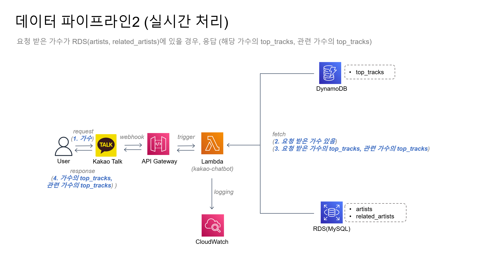

# kakao-chatbot (using Spotify data)

## 🔍 Preview
 
1. 새로운 가수 요청 시, 실시간 응답 및 DB 업데이트
  

&nbsp;&nbsp;&nbsp;&nbsp;&nbsp;&nbsp;&nbsp;&nbsp;&nbsp;&nbsp;&nbsp;&nbsp; </img>
 
 
2. 매일 새벽 3시 배치 처리 이후, 관련 가수 추천
  
&nbsp;&nbsp;&nbsp;&nbsp;&nbsp;&nbsp;&nbsp;&nbsp;&nbsp;&nbsp;&nbsp;&nbsp; </img>
 
 

## 📖 Table of Contents
0. [Background](#0-Background)
1. [프로젝트 소개](#1-프로젝트-소개)
2. [개발 환경](#2-개발-환경)
3. [데이터 모델](#3-데이터-모델)
4. [데이터 파이프라인](#4-데이터-파이프라인)
5. [관련 가수 추천 알고리즘](#5-관련-가수-추천-알고리즘)
6. [파일 설명](#6-파일-설명)
  

## 0. Background
1. `AWS Lambda`: 
2. `AWS Athena`:
3. `.parquet` 포맷: 
4. `RDS`: 
5. `DynamoDB`
6. `S3`

  

## 1. 프로젝트 소개
Spotify API에서 제공하는 artists, top-tracks, audio-features 데이터를 이용하여, 사용자가 가수를 입력하면 관련 가수들을 추천하는 카카오 챗봇입니다. 
  

## 2. 개발 환경

- 언어: `python 3.8`
- 데이터: <a href="https://developer.spotify.com/documentation/web-api">Spotify for Developers - Web API</a>
    1. <a href="https://developer.spotify.com/documentation/web-api/reference/search">Search</a>
    2. <a href="https://developer.spotify.com/documentation/web-api/reference/get-an-artists-top-tracks">Artists</a>
    3. <a href="https://developer.spotify.com/documentation/web-api/reference/get-several-audio-features">Track</a>
- 서버리스 컴퓨팅 서비스: `AWS Lambda`
- 서버리스 컴퓨팅 서비스 트리거: `Amazon API Gateway`, `Amazon EventBridge`
- DB: `Amazon RDS(MySQL)`, `Amazon DynamoDB`
- 스토리지: `Amazon S3`
- 스토리지 쿼리 서비스: `AWS Athena`
  

## 3. 데이터 모델
  

</img>

  

- `artists`: `RDS(MySQL)` 테이블입니다. 가수 관련 데이터입니다.
- `top_tracks`: `DynamoDB` 테이블입니다. 가수 별 인기 트랙들입니다. 관련 가수를 추천하는 데 사용되는 데이터입니다. `Athena` 쿼리 성능 향상을 목적으로 `S3`에도 날짜를 기준으로 파티션을 생성해서 `.parquet` 포맷으로 저장했습니다.
- `audio_features`: 각 트랙 별 음원 특성 데이터입니다. 관련 가수를 추천하는 데 사용되는 데이터입니다. `Athena` 쿼리 성능 향상을 목적으로 `S3`에 날짜를 기준으로 파티션을 생성해서 `.parquet` 포맷으로 저장했습니다.
- `related_artists`: `RDS(MySQL)` 테이블입니다. 관련 가수를 추천하는 데 사용되는 데이터입니다. `Athena`를 통해 `S3`의 데이터(`top_tracks`, `audio_features`)를 분석한 결과입니다.
  
  

## 4. 데이터 파이프라인

  
</img>
  
  

</img>
  
  

</img>
  
  

## 5. 관련 가수 추천 알고리즘

## 6. 파일 설명
